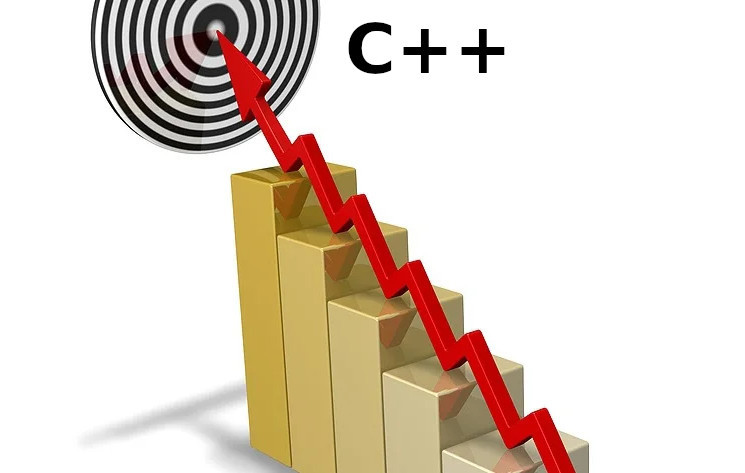

Information about the release of a new version of one or another programming language appears with constant regularity.
And with each new version its capabilities expand, new syntactic constructs or other improvements are added.

And this very much resembles the development of technology, as in any other field of engineering.
When, with each successive stage, the creations being made are perfected.
Faster, higher, stronger … and at the same time significantly more complex.

This problem was made me think by the April Fools' article "Provable programming".

It is clear that the publication date of the article speaks for itself.
Nevertheless, the new C++ standards, the constantly released Java specifications or the new syntax in PHP 8
involuntarily make one wonder whether the development of programming languages is going in the right direction?
After all, most innovations add complexity to the main working tool and, solving some problems, implicitly add many others.

And what should be at the end of the progress in the development of such a discipline as programming?
Or at least of one specific language? For the sake of achieving what final "ideal" goal are new standards of programming languages being developed?

If we fantasize about the ideal final goal of the development of, for example, transport,
then it would be instant movement over any distance with an arbitrary payload and zero energy consumption.

Or, for example, what could be the ideal goal of medicine? ~~The poor would not get sick, and the rich would not recover,~~ probably the treatment of any diseases and biological immortality.

Of course, an "ideal" goal is a very simplified notion. In fact, "ideal" is a synonym for "unattainable",
since it will always run into the need to observe a compromise between various mutually exclusive boundary conditions.

But one cannot compare the development of programming tools with the process of development in other technical disciplines directly.
After all, when creating the final product in any technical field, all complex production operations
that require the direct participation of a human can almost always be divided into separate, simpler parts or stages.

This is done, among other things, so that the complexity of one operation performed is not prohibitive for the performer.
But how can this be done in software development?

In this case, I mean the ultimate limitedness of the capabilities of one specific person as opposed to the possibilities of dividing technological processes into separate stages,
each of which can be performed by completely different people (an example is an ordinary conveyor with its division of labor into elementary operations,
or the narrow specialization of doctors-specialists in one specific field).

After all, it is even hard to imagine a fantastic organization of programmers' labor in the form of a conveyor:
- The first developer writes only function interfaces and their calls, after which he passes the code to the second employee.
- The second writes in the program text only check conditions and unconditional jumps and passes the text to the third.
- The third is responsible for writing loops and the general formatting of the code, etc.
and as a result, complete nonsense is expectedly obtained.

Because of this, the software development industry is forced to follow an extensive path of development (i.e. through an increase in the resources used in production).
Modern industrial programming languages have very rich capabilities for dividing the application code into separate functions/modules/components,
which makes it possible to develop a complex software product by many employees simultaneously at once.

But such development also has a natural limitation. And this limitation is man himself,
since each developer must know and be able to use his working tool, i.e. the programming language.

If we take the analogy with the conveyor given above, then in it each worker would have to know thoroughly the m**a**jority of the machines
and tools in the whole factory, regardless of which **one** specific operation he performs at his workplace.

After all, the paradox of the development of programming languages lies in the fact that by adding new capabilities and syntactic constructs,
we complicate the working tool intended both for joint and for individual use!

And it turns out that simultaneously with the process of constant growth of the capabilities of development tools,
the reverse process also goes on — an increase in the complexity of code development by an individual developer.
In fact, this is precisely that mutually exclusive insurmountable contradiction.

Maybe that is exactly why it is impossible to find a "silver bullet" that would increase the productivity of a single programmer?
After all, the attention and capabilities of a human are not unlimited.
And any innovations and improvements to the programmer's working tool forcibly push the entire IT industry onto the extensive path of development.

Perhaps we should develop fundamentally new approaches instead of chasing syntactic sugar in the programming languages of the last century?

Or not bother at all, continue to use what we have, and let grandpa Darwin's theory put everything in its place on its own?
