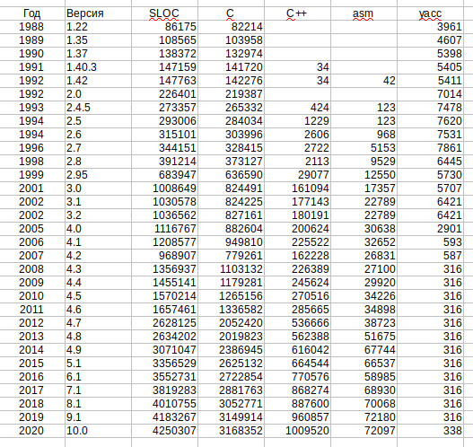
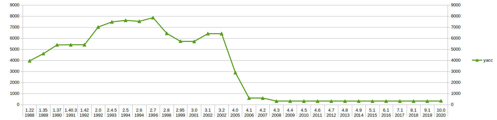
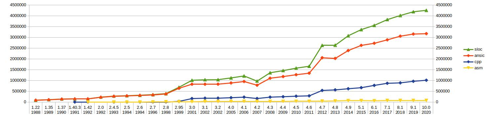
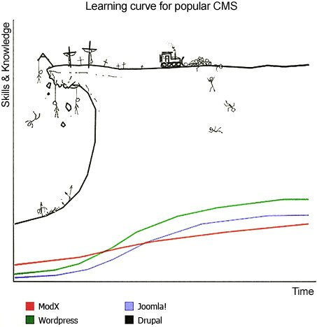

Once again I saw an article on Habr about the complicated business called "programming".
And the fact that programming really is not a simple business is perceived as a fact and usually does not require any confirmation.

But the notion of "complexity" is akin to the term "heap".
For someone, five coconuts is not a heap, and someone ate one and "does not want any more" — so for him even a single coconut will be a lot.

It is the same with software complexity. It would seem that the growth of complexity is obvious to everyone and is observed in all spheres of application of IT technologies,
and programming languages themselves, as they develop, become more and more complex,
but evaluating "complexity" with the help of numerical metrics is a deliberately thankless task, yet "you cannot manage what you cannot measure ...".

Usually talks about "complexity" include only evaluative judgments without any numerical assessment.
And since I am personally interested in the question of the complexity of programming languages,
I decided to measure the complexity of implementing the gcc compiler in some conditional "parrots".
Maybe it will be possible to see some regularities?

## Choosing the "parrots" for measurement
I did not invent my own or compute empirical metrics of software code,
and as a "parrot" I decided to take the simplest metric, SLOC (Source Lines of Code) — the number of lines of the compiler's source text,
which is very easy to compute.

True, with its help one can evaluate the complexity of a language only under the following assumption — the complexity of a language must be in direct dependence on the complexity of its implementation,
if it requires less code for simple syntactic constructs than for more complex ones.

Of course, the use of the "number of source code lines" metric also has its drawbacks,
since it strongly depends on the programming language used, on the source code formatting style and, in the general case, does not make it possible to compare several different projects with each other.

But for a numerical assessment of code complexity within **one project**, the SLOC metric is well suited.

## SLOC counting methodology
Initially I tried to use a simple bash script with a mask search and counting the number of lines in the source files via `wc -l`.
But after some time it became clear that I would have to reinvent another wheel.


So I decided to take a ready-made one. After a quick search I settled on the [SLOCCount](https://dwheeler.com/sloccount/) utility,
which can analyze almost three dozen types of source files.

### List of file types for automatic analysis
```
    1. Ada (.ada, .ads, .adb) 
    2. Assembly (.s, .S, .asm) 
    3. awk (.awk) 
    4. Bourne shell and variants (.sh) 
    5. C (.c) 
    6. C++ (.C, .cpp, .cxx, .cc) 
    7. C shell (.csh) 
    8. COBOL (.cob, .cbl) as of version 2.10 
    9. C# (.cs) as of version 2.11 
    10. Expect (.exp) 
    11. Fortran (.f) 
    12. Haskell (.hs) as of version 2.11 
    13. Java (.java) 
    14. lex/flex (.l) 
    15. LISP/Scheme (.el, .scm, .lsp, .jl) 
    16. Makefile (makefile) - not normally shown. 
    17. Modula-3 (.m3, .i3) as of version 2.07 
    18. Objective-C (.m) 
    19. Pascal (.p, .pas) 
    20. Perl (.pl, .pm, .perl) 
    21. PHP (.php, .php[3456], .inc) as of version 2.05 
    22. Python (.py) 
    23. Ruby (.rb) as of version 2.09 
    24. sed (.sed) 
    25. SQL (.sql) - not normally shown. 
    26. TCL (.tcl, .tk, .itk) 
    27. Yacc/Bison (.y) </code>
```

Moreover, it counts not simply the number of lines of source text, but can also ignore comments,
excludes duplicate files from the count (compares their hash sums), and also outputs the estimated labor intensity,
an approximate cost estimate of developing the analyzed project and other characteristics.

I was initially interested in the volume of sources in C/C++ and maybe also in Assembly, if there turned out to be quite a lot of such files.
But after starting work I was very glad that I did not reinvent the wheel, but took a ready-made tool,
since it separately counted the statistics of the source files of the Yacc/Bison syntax analyzer (.y),
which determines the actual complexity of the parser (read: the complexity of the syntax of the programming language).

I took the old gcc sources from https://gcc.gnu.org/mirrors.html, but before running the analyzer I deleted the directories of other compilers (ada, fortran, java, etc.),
so that they would not get into the final statistics.

## Results in "parrots"



__Final statistics__



__Volume of the Yacc/Bison syntax analyzer code__



__Volume of the overall GCC code base (for the C and C++ languages only)__

## Conclusions
Unfortunately, the Yacc/Bison syntax analyzer was used only up to version 3, and after that its use came to naught.
Therefore one can evaluate the complexity of the C/C++ syntax with the help of the volume of the parser code only approximately up to 1996-98,
after which it began to be gradually removed, i.e. over a little less than ten years.
But even over this period the volume of the code base of the syntax analyzer grew twofold, which approximately corresponds in time to the implementation of the C99 standard.

But even if we do not take into account the code of the syntax analyzer, the volume of the overall code base also correlates with the introduction of new C++ standards: C99, C11 and C14.

The graph does not show a pronounced peak for C+17 and subsequent versions, but I assume
that with the current volume of the code base (more than 4 million lines of C and C++ code alone), the few thousand lines
needed to support the syntactic constructs of the new standards are simply unnoticeable.

### Conclusion one — the obvious one. The growth of the complexity of development tools
In fact, using the example of the GCC project, one can see the constant and inevitable growth of the complexity of the working tools of programmers.

And no matter how much they talk about the degradation of development in the article "Good times breed weaklings",
about the systemic crisis of software, which is generational in nature, it seems to me that the matter is a little different.

The renewal of personnel and, as a consequence, the need to teach new employees the old work,
here the matter is not so much in the transfer of knowledge as in the ability to assimilate this knowledge.

Moreover, the ability to assimilate knowledge will be different for different generations, but not because the previous generation was smarter and the new one lacks the sense to figure it out.
It is simply that the environment changes and the working tools become more complex compared to those that were in use by the previous generation.

### Conclusion two — the entry threshold
Imagine that you need to "make your own website". Naturally, you need to determine which CMS to use for it and which hosting to take.
And if the hosting question is solved very simply, of course TimeWeb, and even with a bonus via the link, then when choosing a CMS one has to think.

And if for simple sites there are also simple solutions, then for those who are not looking for easy paths there is the CMS Drupal,
which is notable for having a fantastically high entry threshold for starting to use it.



Why am I saying all this? When using any tool, like a programming language, there is a certain minimum level of comfortable use.
Moreover, this level is directly proportional to the size of the target audience for which it is intended.
More precisely, the size of the possible audience is determined, among other things, by the requirements for the level of initial knowledge and qualifications of the potential user.


### Final conclusion — not a comforting one
If we consider only the increase in complexity of the software itself, then that is one thing. Here, for example:

__Statistics of the Linux kernel from the wiki__
~~~
September 17, 1991: Linux version 0.01 (10,239 lines of code).
March 14, 1994: Linux version 1.0.0 (176,250 lines of code).
March 1995: Linux version 1.2.0 (310,950 lines of code).
June 9, 1996: Linux version 2.0.0 (777,956 lines of code).
January 25, 1999: Linux version 2.2.0, initially rather unfinished (1,800,847 lines of code).
January 4, 2001: Linux version 2.4.0 (3,377,902 lines of code).
December 18, 2003: Linux version 2.6.0 (5,929,913 lines of code).
March 23, 2009: Linux version 2.6.29, the temporary Linux symbol — the Tasmanian devil Tuz (11,010,647 lines of code).
July 22, 2011: release of Linux 3.0 (14.6 million lines of code).
October 24, 2011: release of Linux 3.1.
January 15, 2012: release of Linux 3.3 crossed the mark of 15 million lines of code.
February 23, 2015: first release candidate of Linux 4.0 (more than 19 million lines of code).
January 7, 2019: first release candidate of Linux 5.0 (more than 26 million lines of code).
~~~

And what to do if the complexity of the software is superimposed on the tendency of constant complication of the working tools themselves?
After all, the constant development of programming languages inevitably raises the entry threshold for all beginners and only aggravates the problem of software development complexity.

In other words, regardless of how well the code is documented and how fully it is covered with tests,
after some time the tools used become obsolete, the life cycles of external dependencies end,
and most importantly, new people come in place of those who developed the system or managed to figure it out.

And the new people have the need to figure out the system from the very beginning, but under different initial conditions.
And because of this, the complexity of studying the system for all new people will be higher simply by the fact that the external conditions have changed and the working tools that the new employees have to use have become more complex.

It is clear that the further we go, the simpler it will no longer be. After all, the field of IT is an environment with the highest competition.
And here how can one not recall Lewis Carroll, that his winged expression
> It takes all the running you can do, to keep in the same place. If you want to get somewhere else, you must run at least twice as fast as that!

After all, this refers not only to Alice in Wonderland, but also to all information technologies as a whole!

Original publication

