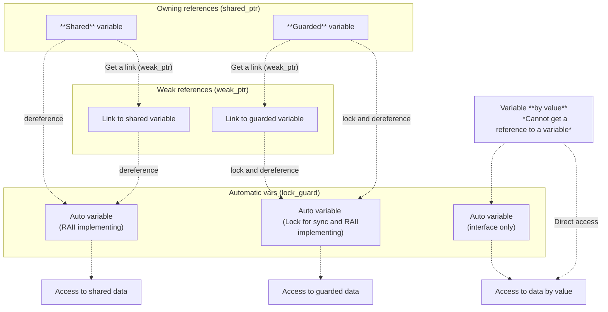

В *NewLang* реализовано безопасное автоматическое управление памятью без сборщика мусора.

Автоматическое освобждение памяти реализовано за счет принципа [RAII](https://en.wikipedia.org/wiki/Resource_acquisition_is_initialization)
и использования двух типов указателей: сильных и слабых ссылок (*shared_ptr* и *weak_ptr* в терминологии С++).

Чтобы не допускать утечек памяти из-за [циклических ссылок](https://doc.rust-lang.org/book/ch15-06-reference-cycles.html), 
создание ***сильных*** *циклических* ссылок запрещено на уровне *определений типов данных* (классов любого уровня вложенности) 
и контролируется статическим анализатором на этапе *компиляции*.

Потенциальные гонки при обращении к памяти из разных потоков решаются за счет *автоматической* межпотоковой синхронизации доступа.
Способ синхронизации доступа указывается при определении переменной, 
а захват и освобождение объекта синхронизации при разименовании ссылки выполняются *автоматически*.

Данная модель безопасного управления памятью портирована на С++ в виде отдельно проекта [memsafe](https://github.com/rsashka/memsafe).

## Терминология {#rules}
### Переменные и их время жизни {#lifetime}
Выделить или освободить участок памяти вручную нельзя.
Выделение и освобождение памяти всегда происходит автоматически при создании/удалении переменных (на стеке или в куче).

По времени жизни переменных в *NewLang* может разделить на два класса:

- [*Постоянные*](/ru/docs/syntax/naming/#sigil) переменные (объекты) - это глобальные переменные, функции и типы данных,
    к которым можно обратиться из любого другого участка кода или модуля.
    Постоянные объекты создаются статически или в куче и сохраняют свое значение после завершения блока кода, 
    где они были определены (после выхода из текущей области видимости).
- *Автоматические* [*(локальные или временные)*](/ru/docs/syntax/naming/#sigil) переменные, это аргументы функций и переменные в выражениях, 
    которые создаются и уничтожаются компилятором *автоматически*.
    Временные объекты доступные только изнутри того лексического контекста, в котором они были определены.
    Такие переменные размещаются на стеке и уничтожается при выходе из блока кода, где были созданы. 

### Виды переменных: {#variables}
Переменные могут быть следующих видов:
- Переменная по значению (*variable by value*) - данные хранятся непосредственно в самой переменной.
    Это переменные в их классическом понимании, когда копия переменной создает дубликат исходного значения,
    а изменение копии никак не влияет на данные у исходой переменной.
    *Создать ссылку на переменную по значению нельзя (для этих целей нужно использовать ссылочную или защищенную переменную)*.
    
- Ссылочная переменная (*reference variable*) - в переменой находится только *сильный (владеющий)* указатель 
    на область памяти с данными (статической или в общей куче).
    Из-за этого копия ссылочной переменной создает копию сильного указателя и **увеличивает счетчик владений**.
    *Ссылочная переменная не имеет механизма межпотоковой синхронизации доступа к данным, как и дополнительных накладных расходов.*

- Ссылочная переменная может быть защищенной (*guarded variable*) - так же ссылочная переменная, 
    но со встроенным механизмом межпотоковой синхронизации и предназначеная для работы с данным, доступ к которым можно получить из разных потоков.

- Ссылка (*link variable*) - в переменой-ссылке находится *слабый (не владеющий)* указатель на ссылочную переменную.
    При копировании переменной-ссылки копирует только слабый указатель **без увеличения счетчика владений**.
    Для доступа к данным с помощью переменной-ссылки используется оператор [блокировки/захвата](#lock),
    который выполняет одновремно и преобразование слабого указателя в сильный и блокировку доступа к данным (если слабая ссылка указывает на защищенную переменную).

### Разыменование (захват/блокировка) ссылок и ссылочных переменных

Доступ к данным у переменных по значению возможен в любой момент, 
тогда как для досутпа к данным у переменных-ссылок и ссылочных переменных требует предварительного [захвата (разименования/блокировки)](/ru/docs/syntax/memory/#lock).

Захват (разыменование/блокировка) ссылок и ссылочных (защищенных) переменных производится всегда в [автоматическую](#lifetime) переменную, 
которая является *временным* владельцем сильной ссылки и выполняет функции удержания
объекта межпотоковой синхронизации в стиле [std::lock_guard](https://en.cppreference.com/w/cpp/thread/lock_guard),
время жизни которого ограничено текущей областью видимости и управляется компилятором автоматически.


*Захват ссылки или защищенной переменной, это не только сохранение сильного указателя во временную переменную 
(т.е. фактически [разименование указателя](https://www.gnu.org/software/c-intro-and-ref/manual/html_node/Pointer-Dereference.html)), 
но и захват владения объектом межпотоковой синхронизации (если он используется).*





### Декларация вида переменной и управление доступом {#links}

[Вид](/ru/docs/syntax/memory/#variables) переменной должен быть указан при её создании 
([предварительном объявлении](/ru/docs/syntax/naming/#forward-declaration)).
Если тип доступа не указан, то будет создана переменная по значению, а компилятор не разрешит создать на неё ссылку и совместный доступ к такой переменной будет не возможен.

Декларация [вида переменной](/ru/docs/syntax/memory/#variables), в том числе и *модель совместного доступа для защищенных перемнных*, 
указывется как тип (номер) ссылки перед именем переменной. Если перед именем перемной ничего не указано - создается переменная по значению.
Если перед имененм переменной указан:
- символ захвата/разименования ("**\***") - создается ссылочная переменная без контроля совместного досутпа
    (для использования только в текущем потоке или для [асинхронного программирования](/ru/docs/ops/async/#async)).
- символ *простой* ссылки ("**&**") - создается ссылочная переменная без объекта межпотоковой синхронизации доступа 
    для использования только в текущем потоке (при захвате ссылки проверяется идентификатор потока).
- символ *защищённой* ссылки с монопольным доступом ("**&&**") - создается защищённая переменная с объектом межпотоковой синхронизации в виде обычного мьютекса.
- символ *защищённой* ссылки с рекурсивным доступом ("**&\***") - создается защищённая переменная с объектом сихнхронизации в виде рекурсивного мьютекса
    (его можно захватывать в одном потоке несколько раз).
- символ *простой* ссылки для совместного доступа ("**&?**") - создается ссылочная переменная без объекта синхронизации доступа,
     для работы с которой требуется использовать [групповой](/ru/docs/ops/with/#light-link) захват ссылок.
 
Все виды ссылок могут быть [константными (иммутабельными)](/ru/docs/syntax/naming/#immutable) ("**&^**", "**&?^**", "**&&^**" или "**&\*^**"), 
т.е. только для чтения (и в случае константных объектов, таким ссылкам объект синхронихации не потребуется даже для защищенных ссылок).

Переменная со слабой ссылкой создается тогда, когда в правой части оператора создания/присвоения 
перед именем общей переменной присутствует любой из операторов получения ссылки 
    (**&**, **&&**, **&\*** или **&^**, **&&^**, **&\*^**). 

При операциях копирования у ссылочных переменных копируется только указатель с увеличением счетчика владения.
Если следует копировать не указатель, а сами данные, тогда в правой части оператора присвоения 
перед именем ссылочной переменной следуюет указть оператор захвата ("**\***"). 

**Пример создания локальных и ссылочных переменных и их копирование:**
```python
    value1 := 1; # Create variable by value
    copy1 := value1; # Create new variable by value from value1

    *owner := 2; # Create reference variable
    local1 := owner; # Error create copy reference to local variable
    local2 := *owner; # Ok. Allow clone value to local variable
    *copy_owner := owner; # Error create from reference variable
    *clone_owner := *owner; # Clone value to new reference variable
    {
        local3 := owner; # Error!!! Copy reference to local variable
        local4 := *owner; # Clone value to local variable
        *copy2_owner := owner; # Copy reference to new reference variable
        *clone2_owner := *owner; # Clone data to new reference variable

        copy2_owner = 23; # Reference variable capture automatically (exclusive access) ????????????????
        *copy2_owner = 23; # The owner variable has new value 23
        # clone2_owner has old value 2
    }
```

**Пример создания защищенных переменных и ссылок:**
```python
    & common: = 3; # Guard variable
    && multi : = 3; # Guard variable + mutex

    common_link := & common; # Weak pointer to common variable
    *common_link = 6; # Set new value 6 to common

    multi_link := && multi ; # Weak pointer to multi variable
    *multi_link = 10; # The multi has new value 10


    & copy_common := common; ?????
    * copy_common := common; ?????
    & copy_common := & common; ?????
    * copy_common := & common; ?????
    & copy_common := *common; # Copy data from common
    * copy_common := *common; # Copy data from common
    {

    }


    && multi_copy := multi; ?????

```
Оператор создания легкой однопоточной ссылки контролирует идентификатор потока, в котором ссылка создается
и эта проверка гарантирует защиту данных от ошибок конкуретнного доступа.


## Захват ссылки/переменной {#lock}
Любые вычисления и преобразования данных возможны только с захваченными переменными.

Захват переменной - это преобразование *слабой* ссылки в *сильную* (если переменная является слабой ссылкой) с инкрементом счетчика владения
и захватом объекта [синхронизации доступа](/ru/docs/syntax/memory/#sync) (при его наличии). 
При захвате ссылки результат сохраняется в *локальную (автоматическую)* переменную и может быть индивидуальным или [групповым](/ru/docs/ops/with/).

Такое использование логики преобразование слабых ссылок в сильные, 
на уровне синтаксиса языка гарантирует последующее автоматическое освобождение временной переменной.

Для захвата переменных используются следующие операторы: 
 - '**\***' - автоматический выбор типа доступа (чтения/запись или только чтение) 
 - '**\*^**' - захват доступа только для чтения
 - '**\*\*( ... )**' - [групповой](/ru/docs/ops/with/) захват ссылок в *локальные (автоматические)* переменные

Упрощенный условный пример:
```python
    ref := & value;  # переменная ref - слабая ссылка на value
    ref_ro := &^ value;  # слабая ссылка на value только для чтения

    val := *ref;  # Автоматический захват ref только для чтения 
    *ref = val;    # Автоматический захват ref для чтения/записи
    obj.*ref = 123; # Запись значения по ссылке ref - члена класса/структуры
    *ptr.*ref = 123; # Запись значения по ссылке ref - члена класса/структуры, которая тоже является ссылкой

    val := *^ ref; # Захват ref только для чтения

    val := *^ ref_ro; 
    val := * ref_ro;  # Автоматический захват только для чтения
    *ref_ro = val;    # Ошибка - ссылка только для чтения !!!
    *^ ref_ro = val;  # Ошибка - (захват lval - только для чтения)
```

### Ссылки и совместный доступ {#sync}

Управление временем жизни переменной включает в себя не только управление памятью, 
но и механизм синхронизации для монопольного/раздельного доступа к объектам из разных потоков.
Поэтому, если переменная разрешает создавать ссылки, 
тогда при обращении к ней требуется выполнять захват для обеспечения работы механизма совместного доступа.

Операторы захвата ссылки и синхронизации доступа к объекту выполняются только для одного действия над переменной.
Но захват объекта синхронизации, это относительно медленная операция и выполнять её для каждого действия над переменной не рационально.

Для того, чтобы однократно захватить объект(ы) синхронизации для выполнения сразу нескольких действий 
над переменными можно захватить объект в локальную переменую или использовать [менеджер контекста](/ru/docs/ops/with/).

### Пример программы {#example}

```python
    rand():Int32 ::= %rand...; # Создание объекта
    @( rand():Int32 ); # Предварительное объявление (объект должен быть создан в другом месте)
    rand():Int32 = ...;

    usleep(usec:DWord64):None := %usleep...;
    printf(format:FmtChar, ...):Int32 := %printf...;


    func(count:Integer, target:String) := {
        $iter := @iter( 1..$count ); # Итератор для диапазона от 1 до $count
        @while( @curr($iter) ) {   # Цикл, пока итератор валидный
            
            $step := @next($iter);  # Получить текущий и перейти на следующий элемент итератора
            
            printf('Number %d from %s!', $step, $target);
                
            usleep( rand() % 1000 );    # Случайная задержка
        }
    }

    thread = :Thread(func, 5, 'thread');

    thread.start();

    func(5, 'main');

    thread.join();

```

```pyton
    Number 1 from the thread!
    Number 1 from the main!
    Number 2 from the thread!
    Number 2 from the main!
    Number 3 from the thread!
    Number 4 from the thread!
    Number 3 from the main!
    Number 4 from the main!
    Number 5 from the main!
    Number 5 from the thread!
```


Ссылка, это всегда слабый указатель на свободный объект. 
Поэтому при попытке создать [*ссылку на ссылку*](/ru/docs/syntax/memory/#link-to-link), 
(получение ссылки у переменной, которая уже содержит ссылку), будет возвращена ссылка на первоначальный объект, а не *ссылку на ссылку*.


### Ссылки на ссылку {#link-to-link} ?????????????????????????????????

Оператор взятия ссылки на переменную не вычисляет её адрес, как это происходит в С++, 
а является указанием(разрешением) компилятору, что он может получить слабую ссылку для ссылочной переменной.
Из-за этого он не являются рекурсивными и создать переменную, содержащую *ссылку на ссылку* нельзя, 
так как оператор получения ссылки всегда возвращает слабую ссылку на общую область памяти ссылочной переменной.

Если по логике работы алгоритма требуется *ссылка на ссылку*, 
тогда для этих целей следует создать новый тип ссылочный данных 
и после этого использовать переменную-ссылку на этот ссылочный тип данных.

Упрощенный условный пример:
```python
    & value: Integer := 123; # Value
    & ref_int:&Integer := & value; # Link for value ?????????????????????????????????
    ref_ref := & ref_int; # ref_ref == ref_int (link to value)
```

```python
    & value := 123; # Value for link
    :RefInt := & Integer; # Reference type
    & ref_int :RefInt := & value; # Link for value
    ref_ref := & ref_int; # Link for link value
```
